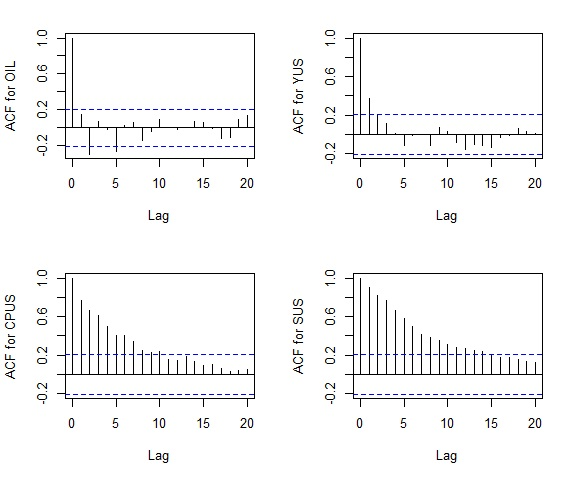

<!-- First: Set your default preferences for chunk options: -->

<!-- If you want a chunk's code to be printed, set echo = TRUE. message = FALSE stops R printing ugly package loading details in your final paper too. I also suggest setting warning = FALSE and checking for warnings in R, else you might find ugly warnings in your paper. -->

```{r setup, include=FALSE}
knitr::opts_chunk$set(echo = FALSE, message = FALSE, warning = FALSE, fig.width = 6, fig.height = 5, fig.pos="H", fig.pos = 'H')
# Note: Include = FALSE implies the code is executed, but not printed in your pdf.
# warning and message = FALSE implies ugly messages and warnings are removed from your pdf.
# These should be picked up when you execute the command chunks (code sections below) in your rmd, not printed in your paper!

# Lets load in example data, and see how this can be stored and later called from your 'data' folder.
if(!require("tidyverse")) install.packages("tidyverse")
library(tidyverse)


slowdown_dataset <- read.table("~/GitHub/Time-Series/replication/data/slowdown_dataset.txt", quote="\"", comment.char="")

slowdown_dataset <- slowdown_dataset %>% rename(Date = V1, OIL = V2, YEMU = V3, CPEMU = V4, SEMU = V5, YUS= V6, CPUS = V7, SUS = V8) 
slowdown_dataset <- slowdown_dataset[-c(131), ] 
slowdown_dataset <-slowdown_dataset[-c(1:39),]


```


<!-- ############################## -->
<!-- # Start Writing here: -->
<!-- ############################## -->

# Introduction 

In this research assignment, I replicate a research assignment by Gert Peersman (2005), a German economist, titled "What caused the early millennium slowdown? Evidence based on vector autoregressions". In this paper, Peersman (2005) uses a simple four-variable VAR (vector autogressive model) and an identification based scheme based on sign restrictions to examine the effects of a supply, demand, monetary policy and oil price shocks. Peersman (2005) uses data from the United States (US) and Euro area. However, this assignment will only focus on analyzing shocks for the US. Peersman (2005) concludes that the millennial slowdown is not the result of one particular shock, but a combination of them. The goal of this assignment is to replicate the results of Peersman (2005) as well as preform additional robustness test to ensure the validity of Peermans (2005) results.

This paper is structured as follows: The second section will give an overview of the paper with respects to the economics, methodology and data that Peersman (2005) used. The third section will replicate the impulse response functions for the US, commenting on any difference found. The four section will perform several diagnostics and robustness checks and the forth section will reach the conclusion that Peersman (2005) chose an appropriate model for his analysis.

# Overview of the paper

This section gives a brief overview of the economics of the paper that I am replicating as well as a critical evaluation of the statistical approach that Peersman (2005) choose to analyze possible causes for the economic slowdown of the US. 

## Theory of Paper

The 1990s was the start of an economic boom for the United States (US) as they experienced the unusual combination of rapid output growth and extremely low and stable inflation. From 1994 to 2002 the US real GDP grew by an average annual rate of almost 4 percent while annual inflation was less than 2 percent.  However, by the end of 2001, the US began to experience negative growth (Peersman, 2005).  Since 2001, the US economy has not experienced close to the same economic growth as before. It is therefore important to understand what caused the slowdown. 

The economic expansion that the US experienced made headlines as it was the longest expansion in economic history.  Many explanations have been offered as to why the US experienced such rapid growth, but overall, it is attributed to numerous factors. Productivity growth increased tremendously which created a favorable investment environment. The private investment opportunities contributed to the advancements in technologies and inspired innovation (Weller, 2002). Furthermore, the Federal Open Market Committee (FOMC) created an environment for the Federal Reserve to keep inflation rates low and stable (Taylor, 1998).  

Another possible reason is that the US economy mostly experienced positive shocks during the late 1990s. The Fed has the responsibility to responds to shocks to the economy to ensure that output, employment, and inflation remain stable.  The Fed can easily respond to a demand shock as it pushed output, employment, and inflation in the same direction. Therefore, the Fed will lower interest rate which will increase money supply to combat the effects of a demand shock. However, a supply shock, such as an increase in oil prices, are more complicated to respond to. With the threat of a recession, the Fed will need to decide whether to prioritize inflation stability or employment stability. The fact that large supply shocks were uncommon during the 1990s was also a factor that greatly influenced the economic boom that the US experienced.

After 10 years of economic growth, the US economy entered into a recession. The 2001/2002 recession was relatively short lived. Kliesen (2003) argues that the recession was caused by shocks to investment by businesses and households and by a decline in real net exports.  However, Kleisen (2003) does recognize that it can be extremely difficult to challenging to discover the root cause of a recession. Understanding fluctuation that effect the growth of an economy has been researched by many economists but it is still relatively poorly understood. Therefore, Peersman (2005) adds value to existing research by examining four shocks (oil, demand, supply, and monetary policy) to analyze the origin of the slowdown.

Peersman (2005) concludes that the slowdown of economic growth was caused by a combination of several shocks. This conclusion is non-surprising and therefore Peersman (2005) main contribution is the impressive mathematical and statistical analysis that he performed. This analysis is discussed in the next section.

## Data and Methodology 
This paper used quarterly data from 1980 to 2002 on the US consumer expenditure index (CPUS), real GDP (YUS), short term nominal interest rate (SUS) as well as data on the oil price (OIL). Changes in CPUS record the rate of consumer inflation while changes in YUS record output growth. The data is then manipulated to display the first difference of the log of OIL, YUS and CPUS and these variables are assumed to be I(1) variables. A I(1) variables means that orginally the data is non-stationary, but now that it has been differenced and demeaned, the data is stationary. The SUS variable is taken as an I(0) variable (Ouliaris, Pagan & Restrepo, 2018). The data is presented in figure 2.1 below.


```{r Figure1, warning =  FALSE, fig.align = 'center', fig.cap = "Data\\label{Figure1}", fig.height = 5, fig.width = 6, dev = 'png'}
library(dplyr)
# Data manipulation. 

y1 = 100*log(as.numeric(slowdown_dataset$YUS))
p1= 100*log(as.numeric(slowdown_dataset$CPUS))
Wp = 100*log(as.numeric(slowdown_dataset$OIL))
s1 <- as.numeric(slowdown_dataset$SUS[-1])

dy1 <- diff(y1)
dp1 <- diff(p1)
dWp <- diff(Wp)

ly <- dy1 - mean(dy1, na.rm=T)
lp <- dp1 - mean(dp1,na.rm=T)
lw <- dWp - mean(dWp, na.rm=T)
ls <- s1 - mean(s1, na.rm=T)

YUS <- ts(ly , start=c(1980,1), frequency = 4)
CPUS <- ts(lp , start=c(1980,1), frequency = 4)
OIL <- ts(lw , start=c(1980,1), frequency = 4)
SUS <- ts(ls , start=c(1980,1), frequency = 4)
vardat0 <- cbind(OIL,YUS, CPUS, SUS)
vardat0 <- vardat0[-c(91),]


plot.ts(vardat0, main="Representation of Data")

```

Peersman (2005) estimates a four-variable constant-coefficient  vector autoregression (VAR) model, with three lags and identifies four shocks. The four shocks that are analyzed in this paper are; two supply shocks, one demand shock and one monetary policy shock. The two supply shocks represents a shock to the oil price and a shock to output growth. The demand shock is associated with a shock to consumer inflation, while the monetary policy shock is associated with a shock to the short term nominal interest rate. Taking the four variables and shocks into account, the equation can be presented as follows: 

\[\begin{bmatrix} \Delta oil_t \\ \Delta y_t \\ \Delta p_t \\ s_t \end{bmatrix} = \Biggl[ I - \sum_{i=1}^{n} A_i \Biggl]^{-1} \begin{bmatrix} b_{11}& b_{12}& b_{13} & b_{14} \\
b_{21}& b_{22}& b_{23} & b_{24} \\
b_{31}& b_{32}& b_{33} & b_{34} \\
b_{41}& b_{42}& b_{43} & b_{44} \end{bmatrix} \begin{bmatrix} \epsilon_t^{oil} \\ \epsilon_t^{s} \\ \epsilon_t^{d} \\ \epsilon_t^{m} \end{bmatrix}\]

Where \(\Delta oil_t\), \(\Delta y_t\) and \(\Delta p_t\) represent the first difference of the price of oil, output growth and the consumer prices respectively. \( s_t\) represents the short term nominal interest rate. The oil price, demand, supply and monetary shock in represented by \(\epsilon_t^{oil}\), \(\epsilon_t^{d}\),  \(\epsilon_t^{s}\) and \(\epsilon_t^{m}\) respectively. 

Peersman (2005) assumes that the variables follow a covariance stationary process. He uses the Dickey fuller test to reject the null hypothesis of the existence of a unit root at a 10 percent level for OIL, YUS and CPUS, however, the null hypothesis for interest rates cannot be rejected. Peersman (2005) makes the assumption that interest rates are stationary since the nominal rate cannot have a unit root if both the real rate and inflation are stationary. This assumption will be intensely analyzed in section 4 during which I will preform numerous robustness checks. 

The paper makes use of a traditional identification strategy using a combination of short-run and long-run restrictions. Peersman (2005) assumes that there is a contemporaneous impact of an oil shock on all variables in the structural VAR (SVAR), but no immediate impact of other shocks on oil prices. This assumption is consistent with previous literature. Further Peersman (2005) adds the restrictions that a monetary policy shock has no contemporaneous effect on output, since monetary policy shocks have a temporary effect on output. To model these contemporaneous effects \(b_{12} = b_{13} = b_{14} = b_{24} = 0\). However, to accurately model the contemporaneous effects, the SVAR needs \([k^2-k]/2\) restrictions, where k represents the number of variables. This implies that a further two restrictions are needed in order to model the VAR successfully, which will be long run restrictions. The contemporaneous matrix that include only short run restrictions is presented below;

\[\ \begin{bmatrix} b_{11}& 0 & 0 & 0 \\
b_{21}& b_{22}& b_{23} & 0 \\
b_{31}& b_{32}& b_{33} & b_{34} \\
b_{41}& b_{42}& b_{43} & b_{44} \end{bmatrix} \]

Peersman (2005) follows Blanchard and Quah (1989), Gali (1992) and Gerlach and Smeth (1995) to add long-run restrictions to the model. He assumes that demand shock has a permanent zero long-run effect of output growth YUS. Furthermore, Peersman (2005) assumes that monetary shocks has a zero long-run impact on output growth but a non-zero effect of OIL and CPUS. Therefore, your long-run restriction matrix will be represented as follow; 

\[\ \begin{bmatrix} *& *& *& * \\
*& *& 0 & 0 \\
*& *& *& * \\
*& *& * & * \end{bmatrix} \]

where the zero's represent the restrictions. In the next section, I replicate and evaluate the impulse response functions that are correlated with the VAR specified by Peersman (2005). 

# Replication

In this section, I use Peersman (2005) data on the US to evaluate the SVAR by plotting impulse response function, 40 periods ahead, with an 84th and 16th percent confidence band. In Peersman (2005) paper, he applies four short run restrictions to his SVAR and two long-run restrictions, adding up to the necessary 6 restrictions that is needed for the evaluation.  In this section, I examine each variables response to the different shocks and compare them to Peersman (2005) results \footnote{Peersman (2005) original results are displayed in appendix A}.

Under the restrictions specified by Peersman (2005), an oil price shock is interpreted as an shock to oil price (OIL), a demand shock is interpreted as a shock to the consumer expenditure index (CPUS), a supply shock is interpreted as a shock to output growth (YUS) and a monetary policy shock is interpreted as a shock to the short term nominal interest rate (SUS). 

## Oil's response

Oil is one of the most important commodities in the world. A lower oil price benefits consumer as it provides cheaper traveling cost and a lower price of gasoline. The oil price also impacts the price of many manufactured goods, therefore it affects every consumer. Thus, it is important to understand how the oil price will respond to different types of shocks. Figure 3.1 shows that there is a permanent effect on the price of oil for all shocks. The oil price increases after a positive demand shock and decrease for a restrictive monetary policy shock. A positive oil shock increases the price of oil. These impulse response functions replicate Peersman (2005) results. 

There is also a permanent effect on the price of oil for a supply shock, which contradicts Peersman (2005) results as he found only a temporary increase in the price of oil after a supply shock. Theoretically, demand and supply shocks have different impacts on the price of oil, where demand shocks are usually more persistent with a larger impact than supply shocks. However, in Figure 3.1, it is observed that they have similar impacts. Therefore, based on my results and Peersman (2005) results, I argue that the effects of a supply shock on oil price is ambiguous.   

```{r Figure2, warning =  FALSE, fig.align = 'center', fig.cap = "Response of Oil Price\\label{Figure2}", fig.height = 5, fig.width = 6, dev = 'png'}

library(vars)
library(cowplot)
library(gridExtra)
# Using data calculated below. 

# Prove that one lag is optimal. 
# We want to get a reduced-form VAR to get an appropriate object that is manipulated into the structural form model 

var1 <- VAR(vardat0, p=3, type="both")

# apply long run restrictions 
model1 <- BQ(var1)


#contemporanous effects
a.mat <- diag(4)
diag(a.mat) <- 1
a.mat[1,2] <- 0
a.mat[1,3] <- 0
a.mat[1,4] <- 0
a.mat[2,1] <- NA
a.mat[3,1] <- NA
a.mat[4,1] <- NA
a.mat[2,3] <- 0
a.mat[2,4] <- 0
a.mat[3,2] <- NA
a.mat[3,4] <- 0
a.mat[4,2] <- NA
a.mat[4,3] <- NA


b.mat <- diag(4)
diag(b.mat)<- NA

svar.one <- SVAR(var1, Amat=a.mat, Bmat=b.mat, hessian=TRUE, max.iter=1000)

RESPONSE = "OIL"
IMPULSE=c("OIL", "YUS", "CPUS", "SUS")

fits=lapply(IMPULSE, function(i){
    irf(svar.one,response=RESPONSE,impulse=i,n.ahead=40,cumulative=TRUE,boot=TRUE, ci=0.84)
})
names(fits) = IMPULSE

plotdf = lapply(names(fits),function(i){
data.frame(
  index = 1:nrow(fits[[i]]$irf[[1]]),
  value=fits[[i]]$irf[[1]][,1],
  Lower=fits[[i]]$Lower[[1]][,1],
  Upper=fits[[i]]$Upper[[1]][,1],
  Impulse = i)
})
plotdf=do.call(rbind,plotdf)

a <-ggplot(plotdf,aes(x=index,y=value)) + 
geom_line() +facet_wrap(~Impulse, scales="free_y") + 
labs(xlab="",ylab="",title="Oil's Response", subtitle ="Response to all shocks accounting for all restrictions", caption="Note:\nOwn calculations" ) +
geom_ribbon(aes(ymin=Lower,ymax=Upper),fill=NA,col="salmon",linetype="dashed") + 
geom_hline(yintercept=0,col="salmon") + theme_bw()

a

```
## Output Growth Response 

To implemented the long-run restrictions specified by Peersman (2005) on output growth, I implement an identification scheme proposed by Blanchard-Quah (1989). In Blanchard-Quah original model, the assumption is made that demand shock has no effect on the long run levels of output. Peersman (2005) makes the same assumption is his papers and also assumes that monetary policy shocks have no impact on output growth in the long run.  As can be seen in Figure 3.2, my results for the response of outgrowth for different shocks are an exact replication of Peersman (2005) results. 

Figure 3.2 shows that output growth responds negatively to an oil shock, and positively to a demand and monetary policy shock. Additionally, a demand and monetary policy shock only have a temporary effect on output growth where the effect of a demand shock is longer lasting. Therefore, a monetary policy shock has a rather insignificant effect on output growth where as a demand shock boost economic growth. 

```{r Figure3, warning =  FALSE, fig.align = 'center', fig.cap = "Response of Output growth\\label{Figure3}", fig.height = 5, fig.width = 6, dev = 'png'}

var1 <- VAR(vardat0, p=3, type="both")

# apply long run restrictions 
model1 <- BQ(var1)

RESPONSE = "YUS"
IMPULSE=c("OIL", "YUS","CPUS", "SUS")

fits=lapply(IMPULSE, function(i){
    irf(model1,response=RESPONSE,impulse=i,n.ahead=40,boot=TRUE, ci=0.84, cumulative = TRUE)
})
names(fits) = IMPULSE

plotdf = lapply(names(fits),function(i){
data.frame(
  index = 1:nrow(fits[[i]]$irf[[1]]),
  value=fits[[i]]$irf[[1]][,1],
  Lower=fits[[i]]$Lower[[1]][,1],
  Upper=fits[[i]]$Upper[[1]][,1],
  Impulse = i)
})
plotdf=do.call(rbind,plotdf)

b <-ggplot(plotdf,aes(x=index,y=value)) + 
geom_line() +facet_wrap(~Impulse, scales="free_y") + 
labs(xlab="",ylab="",title="Output Growth Response", subtitle ="Response to all shocks accounting for all restrictions", caption="Note:\nOwn calculations" ) +
geom_ribbon(aes(ymin=Lower,ymax=Upper),fill=NA,col="salmon",linetype="dashed") + 
geom_hline(yintercept=0,col="salmon") + theme_bw()

b
```
## Consumer Expenditure Index Response

Figure 3.3 shows the response of consumer inflation to all four shocks. These results are identical to Peersman (2005) results except for the effect of a monetary policy shock on inflation. An oil shock and a demand shock has a strong, positive, long run effect on consumer prices. This makes theoretical sense, a demand shock insinuates that consumers want to consumer more, hence they are willing to pay more and therefore inflation increases. Furthermore, Gao, Kim, and Saba (2014) found a positive effect of an oil price shock on total CPI which in mainly attributed to the positive effect on energy intensive CPI. Therefore, Goa, Kim and Saba (2014) supports Peersman (2005) results. 

A supply shock has a strong, negative long-run effect on consumer inflation. One example of this is when an positive supply shock occurs due to an increase in money supply. This benefits consumers and institutions in the short run but as a negative long run effect since money purchasing power decreases. On the other hand, a monetary policy shock seems to have no long-run impact on inflation. This result is concerning as it contradicts Peersman (2005) results of a permanent negative effect on inflation. 

```{r Figure4, warning =  FALSE, fig.align = 'center', fig.cap = "Consumer Expenditure Index\\label{Figure4}", fig.height = 5, fig.width = 6, dev = 'png'}
RESPONSE = "CPUS"
IMPULSE=c("OIL", "YUS", "CPUS", "SUS")
var1 <- VAR(vardat0, p=3, type="both")

# apply long run restrictions 
model1 <- BQ(var1)

fits=lapply(IMPULSE, function(i){
    irf(model1,response=RESPONSE,impulse=i,n.ahead=40, cumulative = TRUE,boot=TRUE, ci=0.84)
})
names(fits) = IMPULSE

plotdf = lapply(names(fits),function(i){
data.frame(
  index = 1:nrow(fits[[i]]$irf[[1]]),
  value=fits[[i]]$irf[[1]][,1],
  Lower=fits[[i]]$Lower[[1]][,1],
  Upper=fits[[i]]$Upper[[1]][,1],
  Impulse = i)
})
plotdf=do.call(rbind,plotdf)

c <-ggplot(plotdf,aes(x=index,y=value)) + 
geom_line() +facet_wrap(~Impulse, scales="free_y") + 
labs(xlab="",ylab="",title="Consumer Expenditure Index Response", subtitle ="Response to all shocks accounting for all restrictions", caption="Note:\nOwn calculations" ) +
geom_ribbon(aes(ymin=Lower,ymax=Upper),fill=NA,col="salmon",linetype="dashed") + 
geom_hline(yintercept=0,col="salmon") + theme_bw()

c
```
## Short Term Nominal Interest Rate Response 

Figure 3.4 is an exact replication of Peersman (2005) result. All shocks have a temporary, positive effect on interest rates. The pass through of an oil and demand shock is longer lived than that of a monetary and supply shock. An oil shock increases interest rates temporarily to counterbalance the inflationary pressure. 

The results are consistent with past literature. Gerlach and Smets (1995) concluded that a monetary policy shock has a positive effect on interest rates. However they found that the interest rates return to starting state at a much faster then what is shown in figure 3.4. Further, they found that interest rates increase after an demand shock for the US and and concluded that an positive supply shocks increase the return to capital and therefore real interest rates. 
```{r Figure5, warning =  FALSE, fig.align = 'center', fig.cap = "Interest Rate Response\\label{Figure5}", fig.height = 5, fig.width = 6, dev = 'png'}
RESPONSE = "SUS"
IMPULSE=c("OIL", "YUS", "CPUS", "SUS")

fits=lapply(IMPULSE, function(i){
    irf(svar.one,response=RESPONSE,impulse=i,n.ahead=40,ortho=TRUE,boot=TRUE, ci=0.84)
})
names(fits) = IMPULSE

plotdf = lapply(names(fits),function(i){
data.frame(
  index = 1:nrow(fits[[i]]$irf[[1]]),
  value=fits[[i]]$irf[[1]][,1],
  Lower=fits[[i]]$Lower[[1]][,1],
  Upper=fits[[i]]$Upper[[1]][,1],
  Impulse = i)
})
plotdf=do.call(rbind,plotdf)

d <-ggplot(plotdf,aes(x=index,y=value)) + 
geom_line() +facet_wrap(~Impulse, scales="free_y") + 
labs(xlab="",ylab="",title="Interest Rate Response", subtitle ="Response to all shocks accounting for all restrictions", caption="Note:\nOwn calculations" ) +
geom_ribbon(aes(ymin=Lower,ymax=Upper),fill=NA,col="salmon",linetype="dashed") + 
geom_hline(yintercept=0,col="salmon") + theme_bw()

d
```

# Robustness checks 

After replicating Peersman (2005) paper, I will now apply numerous diagnostic and robustness test to determine whether a four-variable SVAR(3) is an accurate representation of the data generating process. I first analyze the optimal lag length for the model and then critically test for stationarity. I will first test for the optimal lag length and then preform several test to determine whether the variables are stationary. After, I preform three diagnostic test on residuals which is followed by a granger causality test. Lastly, I evaluate and plot the forecast error variance decomposition. 

## Optimal lag length

Estimating a lag length for a VAR time series model is a critical econometric exercise as one runs the risk of over or under estimation (Liew, 2004). The model specified in the paper uses a lag length of 3. There are four different criteria that one can analyze to decided on an optimal lag length: the Akaike Information Criterion (AIC), the Schwarz Criterion (SC), the Hannan Quinn (HQ) and the Final Prediction Error (FPE). 

As can be seen in the table below, Peersman (2005) chooses the FPE lag criteria for an optimal lag length. The table also shows that there is a large discrepancy between the VAR(10) selected by the AIC and the VAR(1) and VAR(3) selected by the other criteria. This result is not unusual as AIC usually chooses a larger number of lags. Therefore, it is preferred to not use the AIC criteria when choosing a number a lags.


\begin{center}
\begin{tabular}{ |c|c|c|c| } 
 \hline
 AIC(n) & HQ(n) & SC(n) & FPE(n) \\ 
 \hline
 10 & 1 & 1 & 3\\ 
 \hline
\end{tabular}
\end{center}

Liew (2004) conducted a study where he critically analyzed which lag length criteria should be used to determine the VAR lag length. He concluded that AIC and FPE produce the least probability of under estimation when compared to the other selection criteria. Since I have already argued that AIC is not the best lag length criteria for this VAR model, I agree with Peersman (2020) choice of using FPE to decide on a lag length of three. 

```{r}
library(vars)
detach("package:dplyr", character.only = TRUE)
library("dplyr", character.only = TRUE)

#putting my data in a time series object
lag <- VARselect(vardat0, type="both") 
```
## Test for Stationary \label{stationary}
 
Stationarity is a dominant principle in time series analysis. Stationary implies that the statistical properties of a time series variable do not change over time. It is important to know whether your variables are stationary as many of the econometric test that you preform require variables to be stationary. To analyze whether the data is stationary, I plot the autocorrelation function (ACF) for each variable. On the x-axis you will have the number of lags and on the y-axis you will have your autocorrelation value. If the variable is stationary, the ACF will degrade to zero quickly, whereas if they are non-stationary they will slowly diminish as the number of lags increase. As seen in figure 4.1 below, the ACF plot implies that OIL and YUS are stationary variables where CPUS and SUS are non-stationary variables. 

```{r Figure7, warning =  FALSE, fig.align = 'center', fig.cap = "Autocorrelation Function Plot\\label{Figure7}", fig.height = 5, fig.width = 6, dev = 'png'}

#old.par <- par(mfrow=c(2,2))
#plot(acf(x$OIL, lag.max=20, plot=FALSE), ylab="ACF for OIL", main="")
#plot(acf(x$YUS, lag.max=20, plot=FALSE), ylab="ACF for YUS", main="")
#plot(acf(x$CPUS, lag.max=20, plot=FALSE), ylab="ACF for CPUS", main="")
#plot(acf(x$SUS, lag.max=20, plot=FALSE), ylab="ACF for SUS" ,main="")
#par(old.par)
```


To further investigate the stationarity of the dataset, I preform the Augmented Dickey Fuller (ADF) test, with no trend since we detrended our variables. The ADF test is a unit root test for stationarity. I want to test for a unit root since a unit root can bring about an unpredictable result in time series analysis. The ADF test null hypothesis is that there is a unit root present, where the alternative hypothesis is that the time series is stationary. The results of the ADF test are given in the table below: 

\begin{center}
\begin{tabular}{ |c|c|c| } 
 \hline
 variable & ADF statistic & P-value \\ 
 \hline
 OIL & -5.02 & 0.01\\ 
 YUS & -4.50 & 0.01 \\
 CPUS & -3.64 & 0.01 \\
 SUS & -1.09 & 0.2859 \\
 \hline
\end{tabular}
\end{center}
```{r}

library(tseries)
library(ggplot2)
library(dplyr)

detach("package:dplyr", character.only = TRUE)
library("dplyr", character.only = TRUE)

 x <- as.data.frame(vardat0)
a1 <- adf.test(x$OIL)
a2 <- adf.test(x$YUS)
a3 <- adf.test(x$SUS)
a4 <- adf.test(x$CPUS)
```
From this table, we can reject the null hypothesis of a unit root being present for OIL, YUS and CPUS implying that the variables are stationary, but we fail to reject the null hypothesis for SUS. The ADF test results need to be interpreted with caution since it has a high probability of a type I error rate. A type I error is the false rejection of the null hypothesis. Therefore, I also make use of another unit root test, the Phillips-Perron (PP) test. 

The PP test corrects for any serial correlation and heteroskedasticity by building onto the ADF results. Although the ADF test are more widely used, the PP tests are more robust to general forms of heteroskedasticity in the error term. Therefore, it is an appropriate statistic to analyze to determine stationarity. The null hypothesis is the same as the ADF test, that the time series has a unit root, where the alternative hypothesis would be that the time series is stationary. The results for the PP test is displayed in the table below. 

\begin{center}
\begin{tabular}{ |c|c|c| } 
 \hline
 variable & PP statistic & P-value \\ 
 \hline
 OIL & -66.5 & 0.01\\ 
 YUS & -56.3 & 0.01 \\
 CPUS & -17 & 0.01 \\
 SUS & -7.25 & 0.0632 \\
 \hline
\end{tabular}
\end{center}
```{r}
p1 <- pp.test(x$OIL)
p2 <- pp.test(x$YUS)
p3 <- pp.test(x$SUS)
p4 <- pp.test(x$CPUS)
```
Analyzing the results for the PP test, we reach the exact same conclusion as with the ADF test. Therefore, after plotting the autocorrelation function and analyzing two unit root test, we reach the same conclusion that Peersman (2005) reached in his paper. For OIL, YUS and CPUS we reject the null hypothesis of a unit root and concluded that the time series variables are stationary, even though the ACF shows contradicting results for CPUS. 

In all three test preformed, the same conclusion is reached regarding the status of SUS, which is that it is non-stationary. However, Peersman (2005) comes to the same conclusion. Gerlach and Smets (1995) agrue that the nominal rate cannot have a unit root when both the real rate and inflation are stationary. Therefore, the non-stationary result is not of concern. 

## Diagnostic Test on Residuals

To evaluate the model fit, I preform three diagnostic test on the residuals of the model. The first test I preform is a test for white noise residuals using the Portmanteau-test, which test for serial correlation between errors. The null hypothesis is that the errors are white noise, meaning that they are serially uncorrelated and that each error has an identical, independent, mean-zero distribution. The alternative hypothesis is therefore that the errors are serially correlated. I run the Portmanteau-test for 12 lags and obtain a p-value equal to 0.573. Therefore, I fail to reject the null hypothesis. This means that the variables are a white noise process which supports Peersman (2005) use of a VAR(3) model. 
```{r}

test <- serial.test(var1,lags.pt =12, type="PT.asymptotic")

```
For the second diagnostic test I preform a multivariate ARCH\footnote{ARCH stands for Autoregressive Conditional Heteroscedasiticity}-Lagrange-Multiplier test for heteroscedasticity. The alternative hypothesis is that autocorrelation is present in the squared residuals, therefore the null hypothesis is the absence of autoregressive conditional heteroscedasticity. The p-value is greater then 5 percent, implying that there is no heteroscedasticity present. This conclusion supports Peersman (2005) choice of a VAR(3) model. 
```{r}
test1 <- arch.test(var1,lags.multi=12, multivariate.only = TRUE)
```
The final diagnostic test on residuals that I preform, is a test for structural breaks where I apply a cumulative sum (CUSUM) test. If a structural break is present, it could imply that a four variable VAR(3) is not the optimal model to use. In figure xx, I plot each variables empirical fluctuation process to see whether a structural break is present. A structural brake will occur if the fluctuations exceed the 95 percent confidence band. Studying figure xx, there does not seem to be a break in the respective confidence intervals. Therefore, there is no enough evidence to disapprove of the use of a four variable VAR(3) model. 
```{r Figure8, warning =  FALSE, fig.align = 'center', fig.cap = "Test for Structural Break\\label{Figure8}", fig.height = 6, fig.width = 6, dev = 'png'}
bv.cusum <- stability(var1, type = "OLS-CUSUM")
plot(bv.cusum)
```
## Granger Causality 

We would now like to know whether changes in one variable will have a effect on changes in other variables in the dataset. The granger causality test is a test done to determine whether on time series variable is useful in forecasting another. We say that one time series variables (x) granger-causes another time series variable (y) if it depends on its own past values as well as the past values of x. For predicting y, we then need to look at the past values of y and the past values of x. The null hypothesis for the Granger Causaily test is that the variable specified does not granger-cause any of the other variables in the dataset. The results are shown in the table below.

 \begin{center}
\begin{tabular}{ |c|c|c| } 
 \hline
 cause variable & F-stat & P-value \\ 
 \hline
 OIL & 2.8941 & 0.002711\\ 
 YUS & 3.5067 & 0.0003864 \\
 CPUS & 6.9537 & 4.293e-09\\
 SUS & 4.4792 & 1.5995-o5 \\
 \hline
\end{tabular}
\end{center}

For all cause variables, we reject the null hypothesis that the cause-variable does not granger-cause on any of the other time series variables.Therefore, we can derive the following results:
\begin{enumerate}
\item The hypothesis that the oil price does not influence the real GDP index, the consumer expenditure index and the short term nominal interest rate is rejected. This implies that the oil price does influences the US economy. 
\item The hypothesis that the real GDP index does not influence oil price, the consumer expenditure index and the short term nominal interest rate is rejected. This implies that real GDP has an effect on the US economy as well as the oil price, which greatly affects countries that are net importers of oil. 
\item The hypothesis that the consumer expenditure index does not influence the real GDP index, the oil price and the short term nominal interest rate is rejected. This implies that the US citizens spending patterns and behaviors affect the US economy as well as the oil price. 
\item The hypothesis that the short term nominal interest rate does not influence the real GDP index, the consumer expenditure index and the oil price is rejected. This implies that monetary policy greatly affects the US economy and has an affect on the oil price.
\end{enumerate}

```{r}

x <- VAR(vardat0, p=3, type ="both")
oil_gc <- causality(x,cause="OIL")
yus_gc <- causality(x,cause="YUS")
cpus_gc <- causality(x,cause="CPUS")
sus_gc <- causality(x,cause="SUS")

```
## Forecast Error Variance Decomposition

Now that we have determined that all the variables granger-cause each other, we can decompose the variance of the forecast error to determine the impact of the contribution from the shocks specified in the paper.This is done through using the forecast error variance decomposition (FEVD) method.The FEVD plot below displays how important shocks are for explaining variation in the variables. It also gives us a time analysis of the important of certain shocks. For example, for output growth, a monetary shock is not responsible for variation in the short term but it does cause longer term fluctuations.  

The results displayed in figure 4.2 suggest that oil is largely determined by oil shocks Output growth is mostly determined by supply shock but monetary policy shock also has a significant influence on output growth. Inflation is mostly determined by an oil price shock and a demand shock. Interest rates are largely determined by all four shock specified in the model, where a supply shock has the most significant effect on it and a monetary policy shock has a diminishing effect.  

```{r r Figure9, warning =  FALSE, fig.align = 'center', fig.cap = "Forcast error variance decomposition\\label{Figure9}", fig.height = 6, fig.width = 6, dev = 'png'}
library(vars)
var1 <- VAR(vardat0, p=3, type="both")
help <- fevd(var1, n.ahead=10)
plot(help)

```
# Conclusion
This paper sets out to replicates Peersman (2005) results by analyzing the same data set from the US and estimating a four-variable VAR(3) model considering short run and long run restrictions simultaneously. To analyze the model, the impulse response function are graphed taking into account four shocks; an oil price, demand, supply and monetary policy shock. These shocks area associated with the four variables; oil price, consumer inflation, output growth and short term nominal interest rate, respectively. I successfully managed to replicate Peersman's results except for two impulse response functions. The first being the a supply shock to oil and the second being a supply shock to consumer inflation. Supply shocks can be challenging to model and interpret since such a shock tend to change the output-inflation combination in the economy. 

After I replicated Peersman results, I preform numerous robustness test to determine whether a four-variable VAR(3) is a sufficient and accurate model to estimate. I first analyze the optimal lag length by studying four different criteria and conclude that 3 lags is optimal. Secondly, I test whether the variables in the data set are stationary by studying the autocorrelation function, the augmented dickey fuller test and the Philips-Perron test. I concluded that 3 YUS, CPUS and OIL is stationarity, however SUS is non stationary. It can be argued theoretically that SUS is stationary, therefore the results are not concerning. I then preform three diagnostic tests on the residuals on the VAR(3) and find no evidence that disproves of the model. Fourthly, I prefrom the granger causality test to determine whether variables in the model granger-cause eachother. The results were no surprising as macroeconomic variables often affect eachother. Lastly, I plot the forecast error variance decomposition to accurately analyze which variables are affected by which results. 

I therefore find no evidence to disprove the four-variable VAR(3) that Peersman used in his paper. The results from the robustness checks prove that the model is accurate and robust. Peersman correctly specified his model taking into account the non-stationarity of one of the variables. 

word count [4171]

\newpage

# References {-}
Blanchard, O.J., 1989. A traditional interpretation of macroeconomic fluctuations. The American Economic Review, pp.1146-1164.

Gao, L., Kim, H. and Saba, R., 2014. How do oil price shocks affect consumer prices?. Energy Economics, 45, pp.313-323.

Gerlach S, Smets F. 1995. The monetary transmission mechanism: evidence from the G7 countries. CEPR Discussion Paper, 1219.

Jiménez-Rodríguez*, R. and Sánchez, M., 2005. Oil price shocks and real GDP growth: empirical evidence for some OECD countries. Applied economics, 37(2), pp.201-228.

Khan, M. U. H. (2008). Short run effects of an unanticipated change in monetary policy:
Interpreting macroeconomic dynamics in Pakistan. State Bank of Pakistan Working
Paper, 22.

Kliesen, K.L., 2003. The 2001 recession: How was it different and what developments may have caused it?.Review-Federal Reserve Bank of Saint Louis, 85(5), pp.23-38.

Liew, V.K.S., 2004. Which lag length selection criteria should we employ?. Economics bulletin, 3(33), pp.1-9.

Ouliaris, S., Pagan, A. and Restrepo, J., 2016. Quantitative macroeconomic modeling with structural vector autoregressions–an EViews implementation. IHS Global, 13.

Peersman, G., 2005. What caused the early millennium slowdown? Evidence based on vector autoregressions. Journal of Applied Econometrics, 20(2), pp.185-207.

Taylor, J.B., 1998. Monetary policy and the long boom. Federal Reserve Bank of St. Louis Review, 80(6), p.3.

Weller, C., 2002. Lessons from the 1990s: Long‐term growth prospects for the US. New Economy, 9(1), pp.57-61.


# Appendix {-}

## Appendix A {-}


